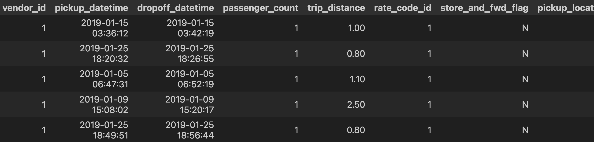
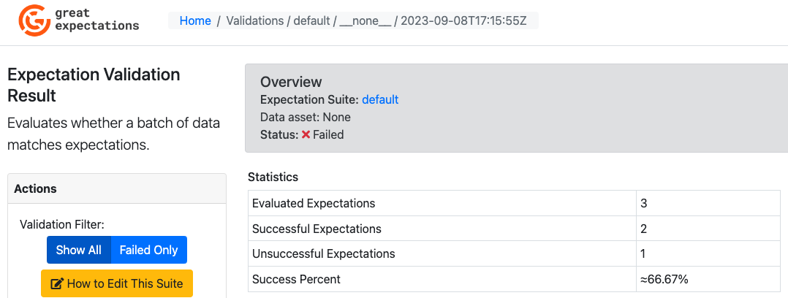
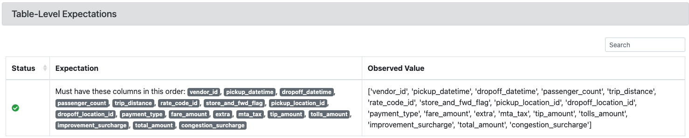
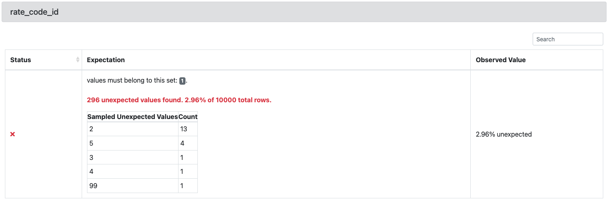
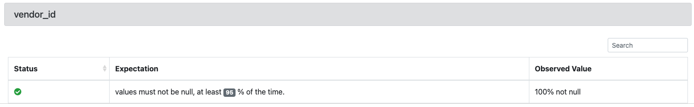

# fer-gx-validator

Validate data sources using Great Expectations Python Library. This project implements a way of working which uses a Validator. See this project for another way of achieving the same results: https://github.com/fembrioni/fer-gx/tree/main

# Project context

This project is intended as a way to get to know "Great Expectations" Python library. It will rely on data coming from the `NCY taxi data` ( https://www.nyc.gov/site/tlc/about/tlc-trip-record-data.page ).

## What can be achived?

The following notebook has the steps you can follow to validate a dataset:

- using_validator.ipynb

You will get the results of validating a dataset against different criteria. The pattern can be applied to build a testing suite against data assets in your pipeline, being them source data as well as transformed data.

### Example:

#### Data source asset

#### What to expect from that asset

- Expect column names in the asset to match this ordered list `["vendor_id", "pickup_datetime", "dropoff_datetime", "passenger_count", "trip_distance", "rate_code_id", "store_and_fwd_flag", "pickup_location_id", "dropoff_location_id", "payment_type", "fare_amount", "extra", "mta_tax", "tip_amount", "tolls_amount", "improvement_surcharge", "total_amount", "congestion_surcharge"]`

- Expect column `rate_code_id` values to be in the set `{1}`. This was intentionally made to generate unexpected values.

- Expect `95%` of the records to `not be null` for column `vendor_id`.

#### What we get from running validations

**Overview of validation process**

**Column names match the ordered list**

**2.96% of rate_code_id column values do not conform to the values in set.** Expectation was intentionally made to generate unexpected values

**The vendor_id column values are not null**

## About the `using_validator` notebook

This notebook allows:

1) The creation of a data context that is persistent across python sessions. "One of the primary responsibilities of the DataContext is managing CRUD operations for core GX objects" .(GX = Great Expectations).

2) The creation of a validator against a data source. The validator also contains an Expectation Suite, which is the placeholder for all the things you expect a certain data asset to conform to. Those things you expect are called Expectations.

    In this case, the expectation suite has the following expectations:

    - expect_table_columns_to_match_ordered_list

    - expect_column_values_to_be_in_set

    - expect_column_values_to_not_be_null

3) The creation of a Checkpoint that will perform validations from an Expectation Suite. The Checkpoint is added to the context for being used when needed.

4) The recovery of the Checkpoint from the context.

5) Obtaining a Result from running the Checkpoint.

6) Showing the Result in HTML format.

7) The manual modification of the Expectations in the Suite.

## Virtual environment

Python version: 3.11.4

Great expectations version: 0.17.12

The `gxvenv` virtual environment has been created to control the environment dependencies and added to .gitignore to prevent it from beeing copied to the repository.
`requirements.txt` contains the required modules and versions for this project.

To install dependencies for this project run (First cell of the notebook installs requirements):

`pip install -r requirements.txt`

# What I learned

Great expectations library allows a "Continuous Integration" testing for ETL processes. It let you run tests on your source data as well as on transformed data. Then, any changes you make to your ETL process can be checked against your expectations by Great Expectations tests.

You can use a Validator to build your Expectation Suite.
